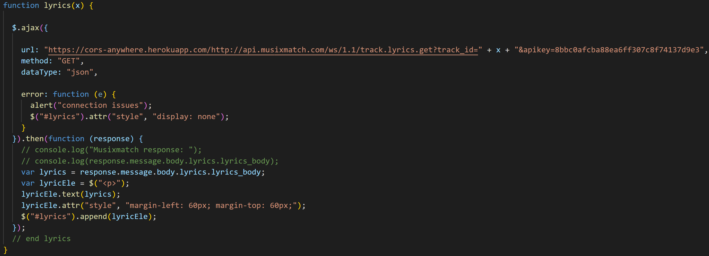
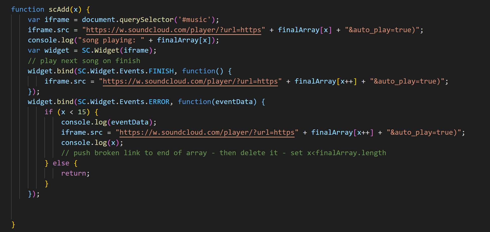

# PLAYR

## Description 
Welcome to our Music Playlist Generator. Here is an easy way to access music and create playlists all at the click of a button avoiding all the clutter of other music sites. You will be presented with a website with a modern design and easy to access features. At the top, you will find a search bar in which the user types in the genre of their liking and the page will then scroll down to the playlist section. The first playlist shown on the page is made up of SoundCloud songs that can be played on the page. The second playlist will consist of working YouTube links that will open a separate tab to play. If lyrics are available for the SoundCloud song playing, they will appear above the playlists. The user is given the option to click on the Save Playlist button to store both the SoundCloud and YouTube playlists with the name of the genre they searched for. These playlists will be stored to local storage and persist through reloads. The user will also have the ability to delete all saved playlists with the Clear Playlist button. At the bottom of the page, the user will find a set of album covers that will directly take the user to YouTube for more music options. For the way our page looks, we used Tailwind CSS as our framework for the overall aesthetic of our page while the animations you will find on our application, we utilized the AOS library, we are able to have animated effects onto our page as well as up and down buttons so that the user does not have to scroll. The application is also mobile responsive.

We utilized the Openwhyd, Musixmatch and SoundCloud Widget APIs to display all content on the page. Openwhyd provided us with the ability to pull song ids, song names, and artist names that we then separated into arrays of SoundCloud and YouTube songs. From there, we used string manipulation to pull the appropriate data to pass on to Musixmatch and the SoundCloud Widget. After checking if lyrics were available for the chosen song, the song ID would then be passed to Musixmatch to grab lyrics and post to the page. If there are no lyrics available, the lyrics div would be hidden from the page. After trimming the song ID over several functions, the final ID is then passed to the SoundCloud Widget to play. The SoundCloud Widget API is also used to error check for broken links. Whenever a 404 error is returned from SoundCloud, the playing song is skipped over. 

## Table of Contents
* [User Story](#user_story)
* [Usage](#usage)
* [Technologies](#technologies)
* [Deployed Link](#deployed_link)
* [Features](#images)
* [Author](#author)
* [Credits](#credits)
* [License](#license)

## Features

This project has a number of features that include the following:

* Navbar

    The Navbar contains the logo of our application, links to other pages in our website as well as a search bar for the user and a *dropdown menu that allows the user to choose between genre, artist or album. The application is mobile responsive so if the user is on a device with a smaller screen, and the user would like to explore other pages of the website, the user will have a collapsable menu on the top left corner of the navbar.

    * Note: Currently the dropdown menu is still in the works.

* Main Page

    The user will have a section to listen to playlists from SoundCloud and YouTube. The user will find a save button and a clear button if they want to keep or delete playlists. The user will also find album covers from YouTube to discover more music. 

* About Us Page

    This page displays a little bit of what we want the user experience to be like.

* Meet the Creators Page

    This page is where you find the creators behind PLAYR and links to their respective accounts.

## User_Story
I am a full time college student with a very busy schedule. I spend most of my time in my car in traffic or studying in my room or at the library. I want an easy to use app that will generate music for me from multiple sources and create playlists. I also want to save my playlist for easy access so that the next time I want to listen to my music, I can just go back to the application and find the saved playlists I like.

## Usage
The first page displayed for the user is the main page which is where they will find a search bar in which they can input a genre. Upon pressing the enter key, the page will scroll down into a playlist area where they will see a YouTube playlist and a SoundCloud playlist. The YouTube playlist will direct them to the YouTube link, and the SoundCloud playlist will play in the built in SoundCloud player. The user has the ability to save and clear playlists by pressing the corresponding buttons under the YouTube and SoundCloud players. By pressing the down arrow at the bottom of the music container, the browser will automatically scroll down to a YouTube artwork area where the user can click the artwork to be directed to a YouTube page with music. Last but not least the user has the option to scroll to the top of the page by clicking the up arrow at the bottom of the page if they desire to search for a different genre. 

## Technologies
* [JavaScript](https://www.w3schools.com/js/)
* [Tailwind](https://tailwindcss.com/)
* [jQuery](https://jquery.com/)
* [Openwhyd API](https://github.com/openwhyd/openwhyd/blob/master/docs/API.md)
* [Musixmatch API](https://developer.musixmatch.com/)
* [Soundcloud Widget API](https://developers.soundcloud.com/docs/api/html5-widget)

## Deployed_Link
[Playr](https://jsp117.github.io/Playr/)

## Images

* Openwhyd API call

* Musixmatch API call

* Musixmatch Lyric grab

* String Manipulation 1 
\
\
* String Manipulation 2

* SoundCloud Widget - Skip when song ends and error checking

## Author
Jon SanPedro, Jerri Fong, and Ivan Torres
* [Jon SanPedro Github](https://github.com/jsp117)
* [Jon SanPedro LinkedIn](https://www.linkedin.com/in/jonathan-s-6ab32283/)
* [Jerri Fong Github](https://github.com/janessaref)
* [Jerri Fong LinkedIn](https://linkedin/in/janessafong)
* [Ivan Torres Github](https://github.com/IvanTorresMia)
* [Ivan Torres LinkedIn](https://www.linkedin.com/in/ivan-torres-0828931b2)

## Credits
* We want to give Credits to all of our TA's and Tutors who helped us thought this project as well as our teamates who this project would have been done without them. 
* [StackOverFlow](https://stackoverflow.com/)
* [W3schools](https://www.w3schools.com/)

## License

MIT License

Copyright (c) [2020] [Jonathan J. SanPedro, Jerri Fong, Ivan Torres]

Permission is hereby granted, free of charge, to any person obtaining a copy
of this software and associated documentation files (the "Software"), to deal
in the Software without restriction, including without limitation the rights
to use, copy, modify, merge, publish, distribute, sublicense, and/or sell
copies of the Software, and to permit persons to whom the Software is
furnished to do so, subject to the following conditions:

The above copyright notice and this permission notice shall be included in all
copies or substantial portions of the Software.

THE SOFTWARE IS PROVIDED "AS IS", WITHOUT WARRANTY OF ANY KIND, EXPRESS OR
IMPLIED, INCLUDING BUT NOT LIMITED TO THE WARRANTIES OF MERCHANTABILITY,
FITNESS FOR A PARTICULAR PURPOSE AND NONINFRINGEMENT. IN NO EVENT SHALL THE
AUTHORS OR COPYRIGHT HOLDERS BE LIABLE FOR ANY CLAIM, DAMAGES OR OTHER
LIABILITY, WHETHER IN AN ACTION OF CONTRACT, TORT OR OTHERWISE, ARISING FROM,
OUT OF OR IN CONNECTION WITH THE SOFTWARE OR THE USE OR OTHER DEALINGS IN THE
SOFTWARE.